*AUTONOMOUS CLOUD BASED IRRIGATION SYSTEM*

Pitch
=====

Autonomous watering system based on Arduino WEMOS D1 mini, controlled via
Android app through Firebase cloud. PCB design. Case designed and 3D printed.
Key features: Wifi multi-hotspot, Timed Deep sleep / wake-up, persistent memory
in sync with cloud, multiplexing of analogue inputs, Secure Cloud communication.

Table of contents
=================

[1 Pitch 1](#_Toc28007739)

[2 Table of contents 1](#table-of-contents)

[3 Purpose & Description 1](#purpose-description)

[4 Overall Design drivers 1](#overall-design-drivers)

[5 What you will need to get going…and done.
1](#what-you-will-need-to-get-goingand-done.)

[6 System overview 1](#system-overview)

[7 Hardware & PCB 1](#hardware-pcb)

[8 Data flow & global data structure 1](#data-flow-global-data-structure)

[9 Google Firebase Cloud 1](#google-firebase-cloud)

[10 Arduino control software 1](#arduino-control-software)

[11 Android App 1](#android-app)

[12 Cross-platform: Adding new fields in database
1](#cross-platform-adding-new-fields-in-database)

[13 3D printed case 1](#d-printed-case)

[14 Physical Water supply 1](#physical-water-supply)

[15 Connecting it all 1](#connecting-it-all)

[16 Daily use, installation, tuning 1](#daily-use-installation-tuning)

[17 Appendix A - Hardware & PCB version 6.0 - not tested
1](#appendix-a---hardware-pcb-version-6.0---not-tested)

[18 Log History 1](#log-history)

Purpose & Description
=====================

Key use case: I wanted to have an autonomous watering system for outdoor
watering on a city terrasse with the following main requirements:

-   Easy installation:

    -   No wires or cabling

    -   A low-pressure thin water tube to each water station

-   Easy use

    -   No maintenance or battery exchange

    -   Monitoring and control from app

    -   Can run autonomously for at least 3 weeks (during a holiday)

-   Easy scale

    -   Low price per unit

    -   Easy assembly

    -   Reproducible

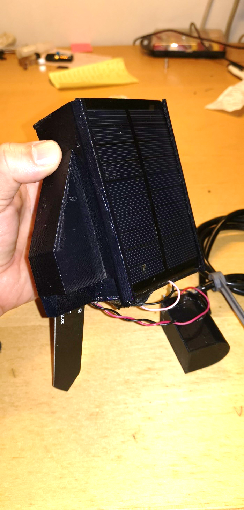

Figur 1. The finished unit. Ready to plug into the soil.

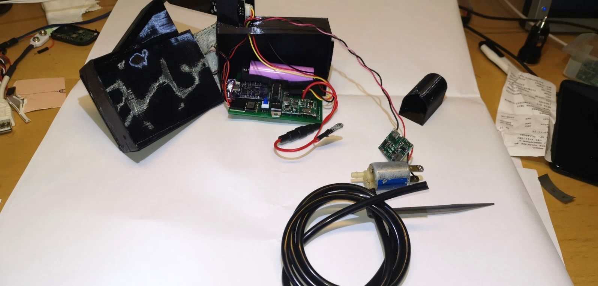

Figur . Same unit - disassembled

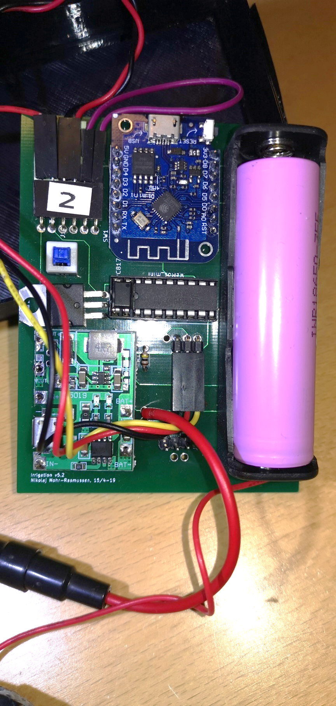

Figur 3. Close-up of the PCB

Figur . The Android app

Overall Design drivers
======================

Based on the key use case, the following was decided up front as system
components:

-   Power supply: Solar panel to power a Li-Ion battery cell.

-   Low water pressure to enable

    -   Thin water hoses (prettier, easy installation, less risk of high water
        spillage if hose breaks).

    -   Solenoid valve with low power consumption.

-   Arduino WeMos D1 Mini

    -   Wifi enabled

    -   Low power

    -   Just enough I/O

    -   Cheap

    -   Small

    -   Large community knowledge

    -   Had already experience with these

-   Cloud based + App

    -   No need for device to be constant online (saves power, gives autonomy)

    -   Collect of telemetry when system online

    -   Enables monitoring and control of device (via app) via internet without
        device being online (commands stored in Cloud)

-   Own 3D printed case

    -   Smallest and cheapest solution…and most fun.

-   Android app

    -   I have an Android phone + tablet

    -   Probably easiest to integrate with a Google Cloud

What you will need to get going…and done.
=========================================

Just to give an indication of the knowledge needed: I am electronics engineer
from 91, and have not been coding professionally since 2000. Besides what I did
on my study, I have never made electronic circuits, no cloud coding, no 3D
modelling, no Android. Except the actual programming, I learned it all through
this and a couple of other projects. So it is not really that advanced - just
get going.

Apart from that, you will need:

-   Some hardware - but not a lot:

    -   Electronics hardware, mainly WeMos D1 mini, a solar panel, and a few
        other components. Details found below.

    -   Water pressure reduction + water hose. Details found below.

-   3D printer + filament. Details below.

-   Soldering tools. Advanced tools not needed.

-   Multimeter is always good.

-   Total cost is less than 15USD per unit, depending on who your “hardware
    pusher is. I am using Aliexpress.

-   Knowledge of

    -   Visual Studio + how to set it up andwork around problems in confurations
        etc.

    -   How to code for Arduino. Of course this works, but you may want to
        modify.

    -   Android SDK + coding in Android.

    -   Autodesk Fusion 360 for 3D models (well - you only need this if you want
        to modify the models).

    -   Google Firebase - step-by-step tutorial included, but again. You
        probably do not want just to clone.

    -   KiCAD knowledge is fine. I started from scratch, and it is fairly
        simple.

    -   Git. Everything is stored on GITHub.

In brieft, you should (details in each section):

1.  Purchase all material.

2.  Download all code, 3D models, documentation and more from GITHub. On top of
    the code, Ive uploaded real source of e.g. the 3D files (and not just the
    printable files), and all the relevant KiCAD files.  
    At least - that was my intent. If something is missing, let me know.

3.  Install the needed tools. You want to find out up front, if there are
    problems here.

4.  Get the PCB ordered - there is some delivery time on this. Gerber files and
    link included (along with source files).

5.  See if everything compiles and installs.

6.  3D print the case. STL files included (along with source files).

7.  Create the firebase account.

8.  When hardware is received, try to install the Arduino/WEMOS software on the
    bare D1 mini. It should at least start and connect to your wifi.

9.  Create and run the Android app. It is actually not needed to test, except if
    you want to delete logs and telemetry. It is also the only way to get a
    graph of the data.

10. When PCB is received, mount all the components.

11. Install the “golden water pressure reducer.

12. Install the water hoses, turn on the water and enjoy a beer.

System overview
===============

Figur . System overview

Hardware & PCB
==============

Tools
-----

1.  All hardware and PCB is designed using KiCAD. Files are found in the GIT
    file.

**Project file: “irrigation v5.2.pro**

NOTE: At the time of writing, I have made a version 6.0 which has not yet been
PCB printed and tested. That can be found in appendix.

Version 5.2 has been in “production for one summer and works fine. Version 6.0
is optimizing the power conversions, which was a bit cumbersome in 5.2. There
are no changes affecting software.

Overview
--------

Figur . Hardware overview.

1.  The hardware modules are all on same PCB, except:

2.  Solar panel

3.  Soil moisture probe

4.  The valve and valve driver (which is a 5V =\> 12V converter). Valve + driver
    has it is own 3D printed case to facilitate that it is stuck in the soil a
    bit away from the probe.

5.  The Lithium battery and the solar panel are both attached to the charge
    unit, which then makes sure to charge the battery whenever possible +
    provides 5V output power for the device.

Components
----------

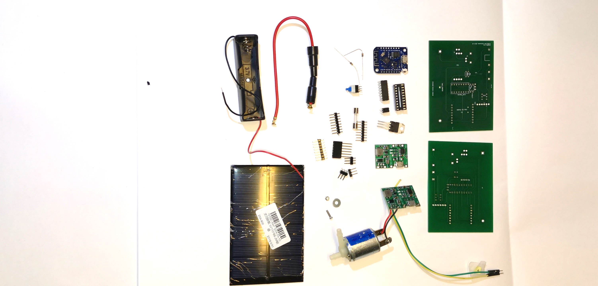

Figur 7. All components. (only 1 PCB is used). (soil sensor missing)

File: irrigation v5.3.html (edited)

| Ref       | Qnty | Value        | Part                               | Link                                                                                                                                                                                                                                                                                                 | Description                                                                           |
|-----------|------|--------------|------------------------------------|------------------------------------------------------------------------------------------------------------------------------------------------------------------------------------------------------------------------------------------------------------------------------------------------------|---------------------------------------------------------------------------------------|
| J1        | 1    | Sol          | Connector:Conn_01x02_Female        | \~                                                                                                                                                                                                                                                                                                   | Generic connector, single row, 01x02, script generated                                |
| J2        | 1    | Soil sensor  | Connector:Conn_01x03_Female        | \~                                                                                                                                                                                                                                                                                                   | Generic connector, single row, 01x03, script generated                                |
| J3        | 1    | Valve        | Connector:Conn_01x02_Female        | \~                                                                                                                                                                                                                                                                                                   | Generic connector, single row, 01x02, script generated                                |
| J4        | 1    | Batt         | Connector:Conn_01x02_Female        | \~                                                                                                                                                                                                                                                                                                   | Generic connector, single row, 01x02, script generated                                |
| J5        | 1    | Spare conn.  | Connector:Conn_01x03_Female        | \~                                                                                                                                                                                                                                                                                                   | Generic connector, single row, 01x03, script generated                                |
| Opto1     | 1    | PC817        | Isolator:PC817                     | <https://www.aliexpress.com/item/Free-Shipping-20pcs-lot-PC817C-PC817-EL817-EL817C-DIP-4-817-transistor-output-optocoupler/2040307423.html>                                                                                                                                                          | DC Optocoupler, Vce 35V, CTR 50-300%, DIP4                                            |
| Q1        | 1    | TIP120       | Transistor_BJT:TIP120              | <https://www.aliexpress.com/item/10PCS-TIP102-TIP120-TIP122-TIP127-TIP142-TIP147-LM317T-IRF3205-Transistor-TIP142T-TIP147T/32868103655.html>                                                                                                                                                         | 5A Ic, 60V Vce, Silicon Darlington Power NPN Transistor, TO-220                       |
| R1        | 1    | 100k         | Device:R                           | \~                                                                                                                                                                                                                                                                                                   | Resistor                                                                              |
| R2        | 1    | 5k           | Device:R                           | \~                                                                                                                                                                                                                                                                                                   | Resistor                                                                              |
| Not shown | 1    | SOIL_SENSOR  | SOIL_SENSOR                        | <https://www.aliexpress.com/item/32832538686.html?spm=a2g0o.productlist.0.0.2a5e131byRhwW0&algo_pvid=8fd1c964-4797-471f-8f57-d15732072438&algo_expid=8fd1c964-4797-471f-8f57-d15732072438-1&btsid=a322b86a-1375-41a4-9e58-6b25d2700253&ws_ab_test=searchweb0_0,searchweb201602_3,searchweb201603_53> | Capacitive soil moisture sensor                                                       |
| SW1       | 1    | ON/OFF       | Switch:SW_SPST                     |                                                                                                                                                                                                                                                                                                      | Single Pole Single Throw (SPST) switch                                                |
| SW2       | 1    | flash        | Switch:SW_Push_Open                |                                                                                                                                                                                                                                                                                                      | Push button switch, push-to-open, generic, two pins                                   |
| U2        | 1    | WeMos_mini   | wemos_mini:WeMos_mini              | <https://www.aliexpress.com/item/ESP8266-ESP-12-ESP-12F-CH340G-CH340-V2-USB-WeMos-D1-Mini-WIFI-Development-Board-D1/32633763949.html>                                                                                                                                                                | WeMos D1 mini                                                                         |
| U4        | 2    | J5019        | NNR-lib:J5019                      | <https://www.aliexpress.com/item/Lithium-Li-ion-18650-3-7V-4-2V-Battery-Charger-Board-DC-DC-Step-Up-Boost/32901921699.html>                                                                                                                                                                          | J5019 Lithium Li-ion 18650 3.7V 4.2V Battery Charger Board DC-DC Step Up Boost Module |
| U5        | 1    | CD4052B      | Analog_Switch:CD4052B              | <https://www.aliexpress.com/item/Free-shippin-10pcs-lot-CD74HC4052E-CD74HC4052-74HC4052-DIP16-Switches-new-original/32549841035.html>                                                                                                                                                                | CMOS double 4-channel analog multiplexer/demultiplexer, TSSOP-16/DIP-16/SOIC-16       |
| bat_18650 | 1    | Battery_Cell | Device:Battery_Cell                | 18650 battery cell                                                                                                                                                                                                                                                                                   |                                                                                       |
| Not shown | 1    | valve        | 12V Normally closed solenoid valve | <https://www.aliexpress.com/item/32850727204.html>                                                                                                                                                                                                                                                   |                                                                                       |
| Not shown | 1    | Solar panel  |                                    |                                                                                                                                                                                                                                                                                                      |                                                                                       |

Schematics
----------

File: irrigation v5.3.sch

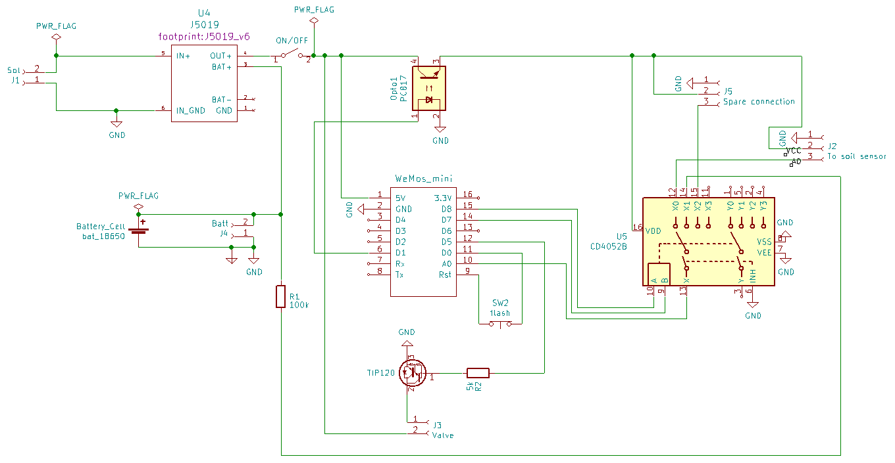

Figur . Schematics.

PCB layout
----------

Supplier: <https://firstpcb.com/>

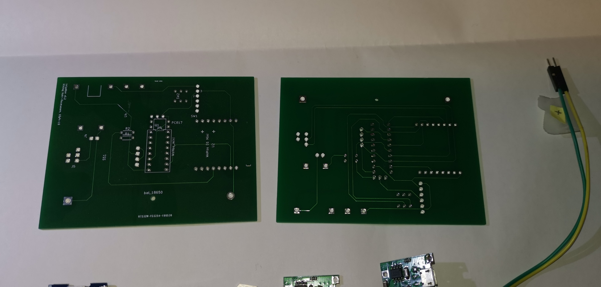

File: irrigation v5.3.kicad_pcb

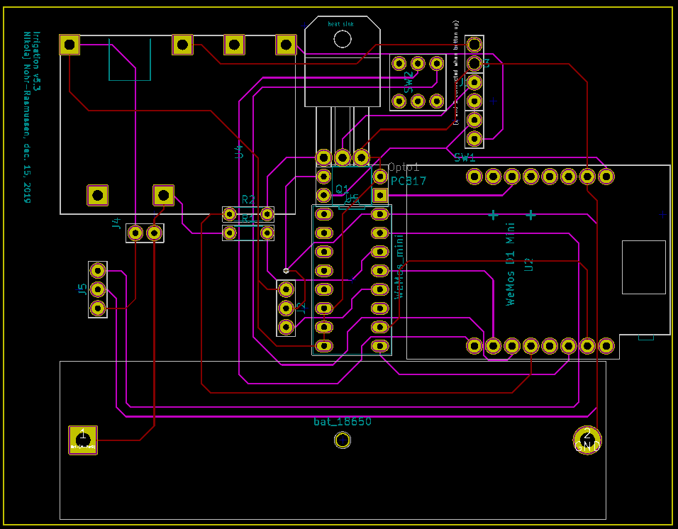

Figur . PCB layout.

Considerations & Notes
----------------------

If this should be made significantly smaller, the way is first to get rid of all
the boards, and use only the components. This is however a “fair amount of work,
and deemed not worth the effort.

Export PCB for print
--------------------

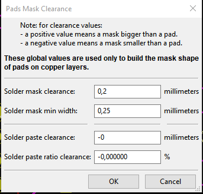

### Export to Gerber files

Result should be the following set of files:

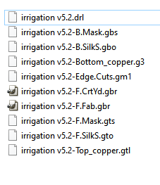

File -\> Plot

Note: It may not be the exact correct values set below.

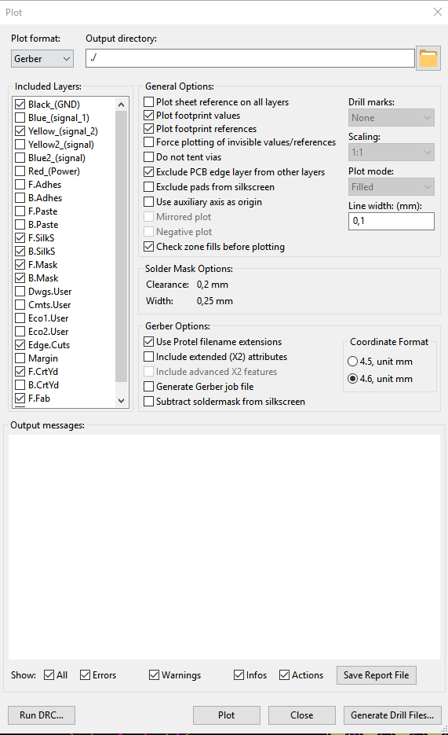

Drill holes:

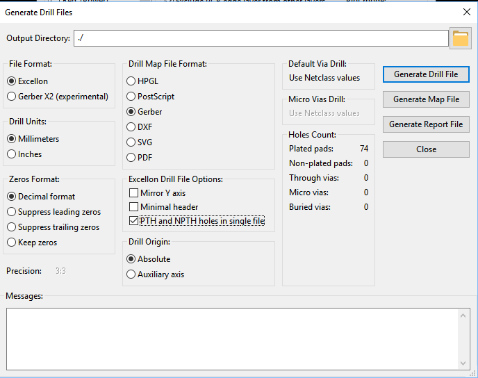

Data flow & global data structure
=================================

Note: Firebase is a JSON database, meaning that it is NOT structured in tables
(like a relational database is).

System Data Flow
----------------

Data structure
--------------

| Table                      | Field name (in Arduino code) | JSON name (Firebase and Android)        | Type    | Notes / usage                                                                                                                                                                                                                                                                                |
|----------------------------|------------------------------|-----------------------------------------|---------|----------------------------------------------------------------------------------------------------------------------------------------------------------------------------------------------------------------------------------------------------------------------------------------------|
| **Irrdevice**              |                              |                                         |         | **(one child per device)**                                                                                                                                                                                                                                                                   |
| **metadata**               |                              |                                         |         | **(Semi-static configuration, can be updated runtime)**                                                                                                                                                                                                                                      |
|                            | macAddr                      | mac                                     | String  | (not updatable, used as unique device key)                                                                                                                                                                                                                                                   |
|                            | location                     | loc                                     | String  | Physical location, e.g. “ved gasbrænderen                                                                                                                                                                                                                                                    |
|                            | deviceID                     | device                                  | String  | Hardcoded to device model identifier, PCB version etc                                                                                                                                                                                                                                        |
|                            | sensorType                   | sensor type                             | String  | What sensor type is used (for future scaling to other kinds of sensors)                                                                                                                                                                                                                      |
|                            | hardware                     | hw                                      | String  | Which hardware is used                                                                                                                                                                                                                                                                       |
|                            | softwareVersion              | sw                                      | String  | Software name and compile time                                                                                                                                                                                                                                                               |
| **state**                  |                              |                                         |         | **(updated by device)**                                                                                                                                                                                                                                                                      |
|                            | SSID                         | SSID                                    | String  | Current hotspot                                                                                                                                                                                                                                                                              |
|                            | runOnce                      | runOnce                                 | boolean | Used for debugging and testing                                                                                                                                                                                                                                                               |
|                            | timestamp                    | timestamp                               | long    | ms since 1970.                                                                                                                                                                                                                                                                               |
|                            |                              |                                         |         | Assigned on Firebase server side                                                                                                                                                                                                                                                             |
|                            | sleepCurCycle                | slpCurCyc                               | int     | Current sleep cycle. Between zero and sleepMaxCycles                                                                                                                                                                                                                                         |
|                            | sleepSecondsToSleep          | slpDura                                 | Int     | Seconds See below                                                                                                                                                                                                                                                                            |
|                            | sleepMaxCycles               | slpMxCyc                                | Int     | See below                                                                                                                                                                                                                                                                                    |
| **settings**               |                              |                                         |         | **(can be set runtime by both device and user)**                                                                                                                                                                                                                                             |
|                            | UserUpdate                   | Updated                                 | boolean | Set to true by app or user if user updates any value. Set to false by device when device reads the values.                                                                                                                                                                                   |
|                            | runMode                      | runMode                                 | String  | Soil\|water\|gas\|sensor\|batt\|testhw The device can run in different modes. For normal autonomous watering, use “soil                                                                                                                                                                      |
|                            | valveOpenDuration            | vlvOpen                                 | Int     | Seconds the valve is open (if soil is too dry)                                                                                                                                                                                                                                               |
|                            | soakTime                     | vlvSoak                                 | Int     | Seconds until soil humidity is measured after watering.                                                                                                                                                                                                                                      |
|                            | humLimit                     | humLim                                  | int     | Percentage If humidity \< humlimit, watering will be performed.                                                                                                                                                                                                                              |
|                            | mainLoopDelay                | loopSec                                 | Int     | Seconds to wait between the loop cycles within a single power cycle. The device is awake during this waiting time, so it should not be too long.                                                                                                                                             |
|                            | debugLevel                   | db                                      | int     | 0: only fatal errors are logged to the Firebase log 1-4: more and more logs.                                                                                                                                                                                                                 |
|                            | sleepEnabled                 | slpEnabl                                | boolean | Sleep control parameter.                                                                                                                                                                                                                                                                     |
|                            | totalSecondsToSleep          | totSlp                                  | int     | Sleep control parameter. Total seconds for a sleep cycle. During runtime it is converted to sleepSecondsToSleep and sleepMaxCycles as: sleepMaxCycles = \# of cycles sleeping at max_sleep_duration (hardware number) sleepSecondsToSleep = remainder (last sleep cycles has this duration). |
|                            | wakeupTime[0..3]             | wakeTime0 wakeTime1 wakeTime2 wakeTime3 | String  | Sleep control parameter. HHMMSS 0/1/2 used to set 3 different wake up times per day. 3 is used internally by the device and should not be altered.                                                                                                                                           |
|                            | pauseWakeTime                | pauseTime                               | String  | Sleep control parameter. HHMMSS NOTE: This is not used by the device. Left-over.                                                                                                                                                                                                             |
| **telemetry\_**            |                              |                                         |         | **(last set of values received from device)**                                                                                                                                                                                                                                                |
| **current**                |                              |                                         |         |                                                                                                                                                                                                                                                                                              |
|                            | Vcc                          | Vcc                                     | float   | Measured battery voltage (provided measurement mode is “battery voltage )                                                                                                                                                                                                                    |
|                            | humidity                     | Hum                                     | float   | Measured humidity (provided measurement mode is “humidity )                                                                                                                                                                                                                                  |
|                            | lastAnalogueReading          | lastAnalog                              | int     | Voltage Raw reading (0-1023)                                                                                                                                                                                                                                                                 |
|                            | lastOpenTimestamp            | lastOpen                                | string  | Time when the valve was opened the last time (readable format)                                                                                                                                                                                                                               |
|                            | timestamp                    | timestamp                               | long    | ms since 1970.                                                                                                                                                                                                                                                                               |
|                            |                              |                                         |         | Assigned on Firebase server side                                                                                                                                                                                                                                                             |
|                            | valveState                   | vlvState                                | int     | 0: valve closed, 1: valve open                                                                                                                                                                                                                                                               |
|                            | wifi                         | Wifi                                    | int     | Wifi signal strength in dB                                                                                                                                                                                                                                                                   |
| **telemetry**              |                              |                                         |         | **all values received from device. One entry per timestamp**                                                                                                                                                                                                                                 |
|                            | Same as telemetry_current    |                                         |         |                                                                                                                                                                                                                                                                                              |
| **log**                    |                              |                                         |         | **Real time log (controlled by debugLevel)**                                                                                                                                                                                                                                                 |
|                            | time                         | ts                                      |         |                                                                                                                                                                                                                                                                                              |
|                            | text                         | txt                                     |         |                                                                                                                                                                                                                                                                                              |

Considerations & Notes
----------------------

Google Firebase Cloud
=====================

We use a **Google Firebase Realtime database** as cloud.

Configuration
-------------

1.  <https://console.firebase.google.com/>

2.  Sign up, if needed.

3.  Create a project: Create project

    1.  Name: irrigation

        1.  Note that this name is used in noth Arduino (FIREBASE_HOST)

        2.  Android code (FB_PROJECT_ID) + in app/google-services.json

    2.  ID: irrigation-XXXXXXX

4.  Activate the free trial, if needed

1.  Select Develop =\> Database

2.  Choose to create a new Realtime Database (NOT a Cloud Firestore). Start in
    test mode, but be aware to change later.

    1.  Auth tokens (Database secrets)

Go to Project overview -\> Settings -\> Service accounts

Show and Copy the “secret and insert into Arduino code (typically called
FIREBASE_AUTH)

-   Used in Arduino code in autoirrigation.ino

-   Android code: in app/google-services.json

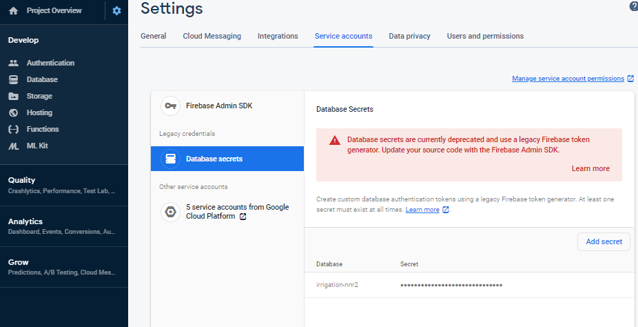

Links
-----

<https://github.com/GoogleCloudPlatform/google-cloud-iot-arduino>

<https://console.cloud.google.com/home/dashboard?project=cohesive-photon-227011>

<https://console.cloud.google.com/iot/registries?project=cohesive-photon-227011&folder&organizationId&pli=1>

<https://console.cloud.google.com/iot/registries?project=autoirrigation&orgonly=true&supportedpurview=organizationId&walkthrough_tutorial_id=iot_core_quickstart>

Arduino control software
========================

Features
--------

The Arduino software has the following features:

-   Wifi handling

    -   The device will look up a number of predefined hotspots and hook up to
        the first with signal strength above a threshold (to save power, we will
        not hook up to a very weak hotspot).

    -   It will remember the last good hotspot, which allows that the device can
        be moved between e.g. the office and the garden.

-   Deep sleep handling using

    -   Timed wakeup (there are 3 timers per day)

    -   Periodic wake-up: set the time until next wake-up

-   Persistent memory handling

    -   Maintains a mirror of the settings in the cloud. When waking, it reads
        setting, if they have been altered by the user. During runtime, some
        settings may be changed and uploaded to the cloud.

    -   Settings only used internally by device, e.g. last used wifi password
        that worked

-   Multiplexing of analogue input signals

    -   The device can control a multiplexer, allowing to read from several
        sensors. The D1 mini only has one analog port.

    -   This feature also controls the power supply to the sensors (so they only
        use power when measuring).

-   Secure Cloud communication.

    -   There are functions to communicate with Firebase, Azure and Google
        Cloud. Each cloud has it is drawbacks and advantages. This is compile
        time controlled.

Software Components
-------------------

-   Globals (globals, firebasemodel)

    -   Global types and structures

    -   Global names and constants

-   Configuration and main control (autoirrigation.ino)

    -   Compile time configuration

    -   Runtime configuration

    -   Debug configuration

    -   Authentication info

    -   Operating modes (test modes)

    -   Type of device (I am also developing a CO gas sensor; not yet finished)

    -   All communication to cloud (note: there is working software for using
        both Azure and Google Cloud)

-   Power & Sleep (deepsleephandler)

    -   Deep Sleep management

-   Persistent storage (persistentmemory)

    -   Control of the internal persistent memory in the D1. Essentially
        maintaining a mirror of the settings in Firebase.

-   Sensors (analogmux, sensorhandler, soilhumiditysensor, watersensor,
    voltmeter, gassensor)

    -   Multiplexer control

    -   Configuration (different sensors can be used in different ways)

    -   initialization

    -   monitoring

-   Actuators (watervalve, LEDhandler)

    -   Configuration & link to sensors

    -   Initialization

    -   Controlling

-   Wifi mgt (wifi_nnr, wifihandler)

    -   Initialization

    -   connectivity

-   Cloud comm (incl in autoirrigation.ino)

    -   connection

    -   reporting

Tools & setup
-------------

-   Visual Studio Community 2019

-   vMicro extension

-   Create the file wifipasswords.h as described in wifi_nnr.ino. You cant
    compile without it.

-   Install my homemade libraries (also found on my GITHub).

-   Install all needed arduino libraries. Just continue installing until you run
    out of compilation errors 😊

### vMicro extension setup

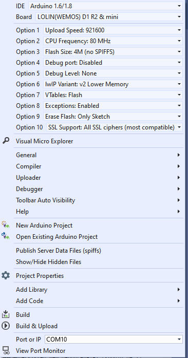

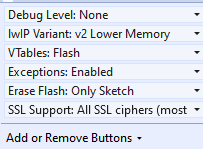

### Uploading to board - and problems/tips

Note that when uploading there are two things that can tease a bit:

-   Remember to push the small “flash button before flashing. “Unpush the button
    when flashed - otherwise the board will not reset.get if you forget is
    something like “The uploader process failed .

-   If the board is in a long series of sleeps, it will wake up, and immediately
    go back to sleep each time it is reset - until the sleep counter reach it is
    target (zero). You can follow that in the serial output window. Disable this
    by disabling UseSleepMode.

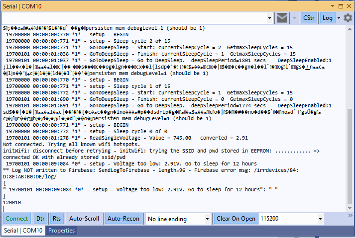

Figure 1. The sleep feature may tease when debugging.

-   If the battery voltage is too low, the board will enter sleep immediately.
    This may provoke a crash dump somehow. Not sure why, but it looks like this.
    If it happens - charge the battery.

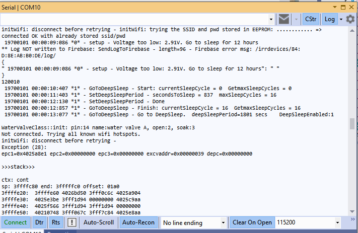

Figure 2. Message you get if battery is flat.

Future features:
----------------

-   OTA update. That would really be nice - in particular because the devices
    are placed outdoor in soil.

Android App
===========

I may use wrong terminology here - I am not very familiar with Android. But the
simple app works 😊

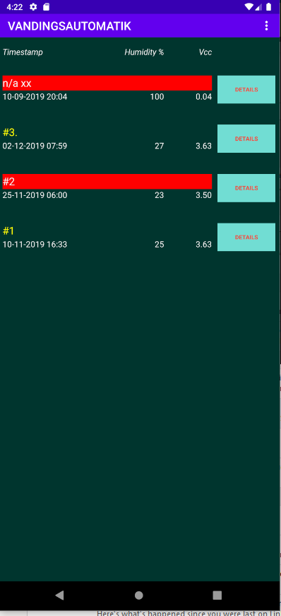

Features
--------

-   Hooks up to Firebase and reads + writes data

-   Presents a graph of the data

Overview
--------

-   Main layout:

    -   List of all devices in Firebase with most important data + color code
        for status.

-   Single device layout

    -   Zoom to all relevant settings (yellow) and telemetry of a single device.

    -   Options for purging both telemetry and log data (if there is a lot of
        data, I have not found a way to purge from the WEB interface to
        Firebase).

-   Background service

    -   Maintaining the interface to Firebase + the data

configuration
-------------

Get the google-services.json configuration file from:
<https://support.google.com/firebase/answer/7015592?hl=en>

Tools
-----

-   Android Studio used

Cross-platform: Adding new fields in database
=============================================

Arduino 
--------

Data structure is defined in source code files:

-   Globals.h

-   Persistentmemory.cpp

-   AutoIrrigation.ino

    -   Function CreateTelemetryJson() defines the data transmitted.

-   WaterValve.h

-   WaterSensor.h

Android
-------

-   Source files defining the data structure is under com.vanding.datamodel/

-   FirebaseObject.java encapsulate this data

-   res/layout/content_main.xml and content_single_device.xml contains the
    visual implementation.

3D printed case
===============

Order of design
---------------

1.  Model each hardware component. Placed in separate proejcts.

2.  Import needed

3.  Place them physically as wished

4.  Create base floor. Project spefici markers from the needed components -
    nothing else.

Main components
---------------

F3d files: 3D models of hardware components. This makes it way easier to try out
different layouts.

F3z files: Design of the casing for the irrigation unit. These are importing the
hardware models.

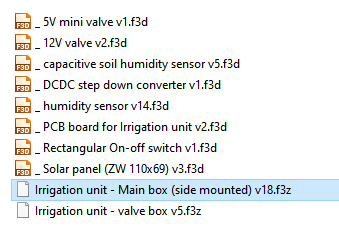

### Main Box for PCB

File: Irrigation unit - Main box (side mounted)

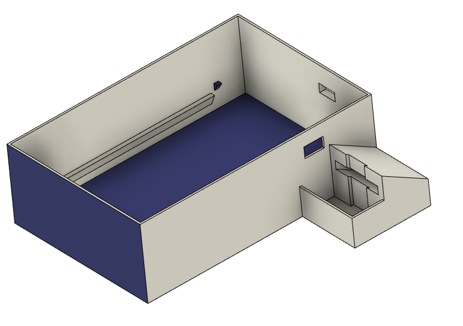

Figur . Main box

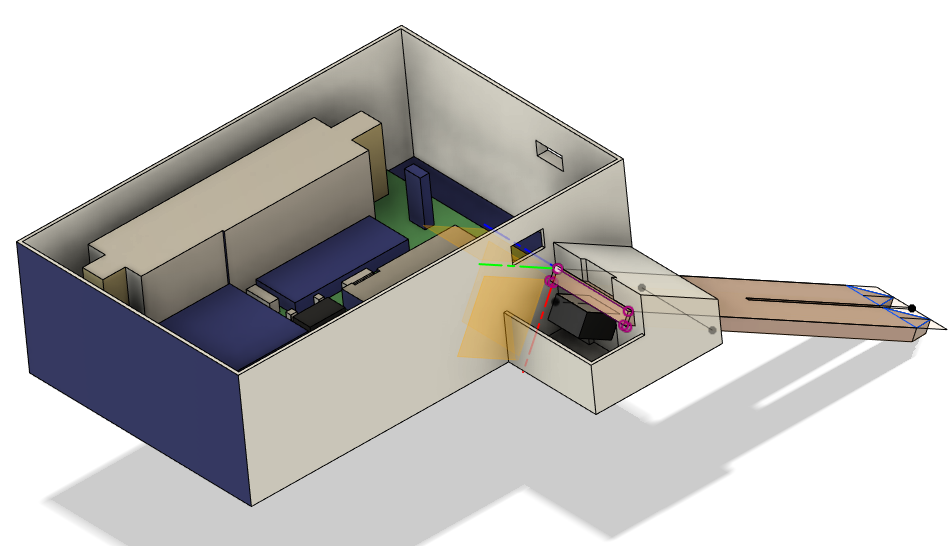

Figur 11. Main box with model of PCB and soil sensor.

### Top box with solar panel

File: Irrigation unit - Main box (side mounted)

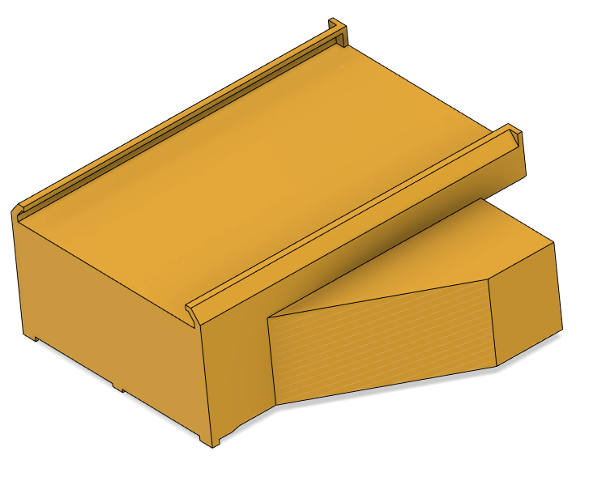

Figur 12. Ceiling to main box

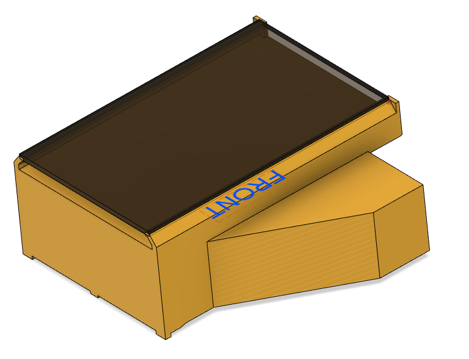

Figur . ...with solar panel

### Box for valve and valve driver

File: Irrigation unit - valve box

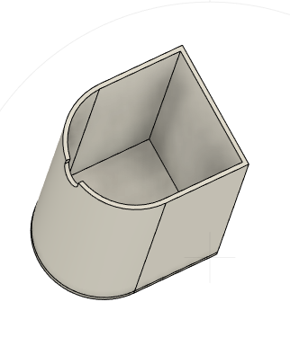

Figur 14. Box for valve and valve driver - seen from the bottom.

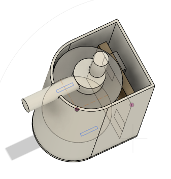

Figur ...with components inside

Considerations and notes
------------------------

The principles has been to make it rain resistant by using the fact that “water
do not run upwards 😊 . So it is not water or dust tight, but it can withstand
heavy rain, as long as the device is properly put in the ground.

Tools
-----

-   AutoDesks Fusion360

-   XYZWare Da Vinci Mini w 3D printer

Physical Water supply
=====================

A regular water outlet produce way too much pressure, so reducing the pressure
is essential. It is the basis for

-   reducing risk of water spill in case of malfunctions somewhere

-   reducing power consumption. A higher pressure requires a stronger valve,
    requiring much more power.

-   Having a visually lighter installation, i.e. thinner hoses.

Hardware
--------

### 4/6 mm (inner/outer diameter) flexible water hose.

(link may come later)

### Adjustable water pressure reducer

<https://www.aliexpress.com/item/DN15-Adjustable-Brass-Water-Pressure-Reducing-Regulator-Valve-Internal-and-outer-thread-PN-1-6-and/32964829770.html>

DN15 Adjustable Brass Water Pressure Reducing Regulator Valve Internal and outer
thread PN 1.6 and Pressure Gauge.

-   Material: Brass

-   Connector Size: DN15(G1/2 )

-   Connection Type: Internal /outer Thread

-   Package Contents:

-   1 x Water Pressure Reducing Valve+Wrench+raw material belt

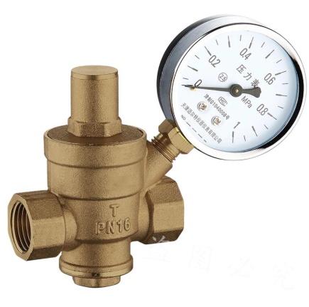

Adjustment
----------

From my memory, water pressure is around 0,1 bar. If it is too high, the valve
will not operate. If too low then it takes too long to water =\> higher power
consumption. An open valve uses \~10W (12V, 1A).

Connecting it all
=================

When done, there are a few pieces that need to be put together.

The main pieces are here:

Daily use, installation, tuning
===============================

Installation 
-------------

The hard work pays off:

-   Install the water tubes

-   Install each device. Give each device a good name - and maybe a sticker on
    the outside, so you can recognize it visually.

-   Make sure the wifi works, check the strength.

-   Check via the app

Appendix A - Hardware & PCB version 6.0 - not tested
====================================================

Version 6.0 is optimizing the power conversions, which was a bit cumbersome in
5.2. There are no changes affecting software.

Components
----------

File: irrigation v6.0.html

**Component Count:**16

| Ref       | Qnty | Value                               | Part                                  | Description                                                                                            | Vendor                                                                                                                                        |
|-----------|------|-------------------------------------|---------------------------------------|--------------------------------------------------------------------------------------------------------|-----------------------------------------------------------------------------------------------------------------------------------------------|
| J1        | 1    | Connector to Solar panel            | Connector:Conn_01x02_Female           | Generic connector, single row, 01x02, script generated (kicad-library-utils/schlib/autogen/connector/) |                                                                                                                                               |
| J2        | 1    | Connector to Batt                   | Connector:Conn_01x02_Female           | Generic connector, single row, 01x02, script generated (kicad-library-utils/schlib/autogen/connector/) |                                                                                                                                               |
| J3, J4    | 2    | Connector to Valve                  | Connector:Conn_01x02_Female           | Generic connector, single row, 01x02, script generated (kicad-library-utils/schlib/autogen/connector/) |                                                                                                                                               |
| J5        | 1    | Connector to Capacitive soil sensor | Connector:Conn_01x03_Female           | Generic connector, single row, 01x03, script generated (kicad-library-utils/schlib/autogen/connector/) |                                                                                                                                               |
| L1        | 1    | 12V Valve                           | Device:Electromagnetic_Actor          | Electromagnetic actor                                                                                  |                                                                                                                                               |
| Opto1     | 1    | PC817                               | Isolator:PC817                        | DC Optocoupler, Vce 35V, CTR 50-300%, DIP4                                                             | <https://www.aliexpress.com/item/Free-Shipping-20pcs-lot-PC817C-PC817-EL817-EL817C-DIP-4-817-transistor-output-optocoupler/2040307423.html>   |
| Q1        | 1    | TIP120                              | Transistor_BJT:TIP120                 | 5A Ic, 60V Vce, Silicon Darlington Power NPN Transistor, TO-220                                        | <https://www.aliexpress.com/item/10PCS-TIP102-TIP120-TIP122-TIP127-TIP142-TIP147-LM317T-IRF3205-Transistor-TIP142T-TIP147T/32868103655.html>  |
| R1        | 1    | 100k                                | Device:R                              | Resistor                                                                                               |                                                                                                                                               |
| R2        | 1    | 5k                                  | Device:R                              | Resistor                                                                                               |                                                                                                                                               |
| SW1       | 1    | flash                               | Switch:SW_Push_Open                   | Push button switch, push-to-open, generic, two pins                                                    |                                                                                                                                               |
| U1        | 1    | J5019                               | NNR-lib:J5019                         | J5019 Lithium Li-ion 18650 3.7V 4.2V Battery Charger Board DC-DC Step Up Boost Module                  | <https://www.aliexpress.com/item/Lithium-Li-ion-18650-3-7V-4-2V-Battery-Charger-Board-DC-DC-Step-Up-Boost/32901921699.html>                   |
| U2        | 1    | 12-24V to 1.8-12V_DCDC_converter    | NNR-lib:12-24V-1.8-12V_DCDC_converter |                                                                                                        | <https://www.aliexpress.com/item/Ultra-Small-Size-DC-DC-Step-Down-Power-Supply-Module-3A-Buck-Converter-Adjustable-1-8V/32880983608.html>     |
| U3        | 1    | WeMos_mini                          | wemos_mini:WeMos_mini                 | WeMos D1 mini R2                                                                                       | <https://www.aliexpress.com/item/ESP8266-ESP-12-ESP-12F-CH340G-CH340-V2-USB-WeMos-D1-Mini-WIFI-Development-Board-D1/32633763949.html>         |
| U4        | 1    | CD4052B                             | Analog_Switch:CD4052B                 | CMOS double 4-channel analog multiplexer/demultiplexer, TSSOP-16/DIP-16/SOIC-16                        | <https://www.aliexpress.com/item/Free-shippin-10pcs-lot-CD74HC4052E-CD74HC4052-74HC4052-DIP16-Switches-new-original/32549841035.html>         |
| bat_1     | 1    | Battery_Cell                        | Device:Battery_Cell                   | Single-cell battery type 18650                                                                         |                                                                                                                                               |
| SOLAR     | 1    | Solar panel                         |                                       |                                                                                                        | <https://www.aliexpress.com/item/ANBES-Solar-Panel-5V-6V-12V-Mini-Solar-System-DIY-For-Battery-Cell-Phone-Chargers-Portable/32848710253.html> |
| Not shown | 1    | valve                               | 12V Normally closed solenoid valve    |                                                                                                        | <https://www.aliexpress.com/item/32850727204.html>                                                                                            |

Schematics
----------

File: irrigation v6.0.sch

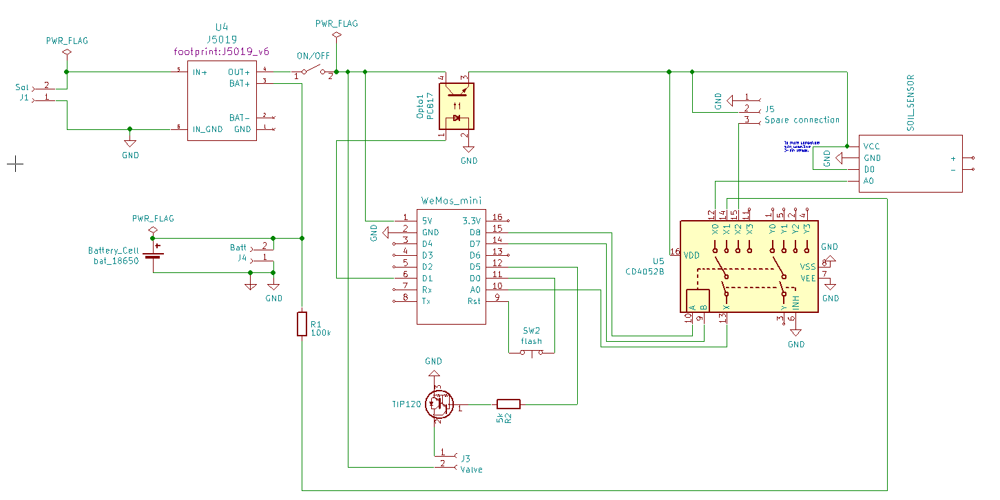

PCB layout
----------

File: irrigation v6.0.kicad_pcb

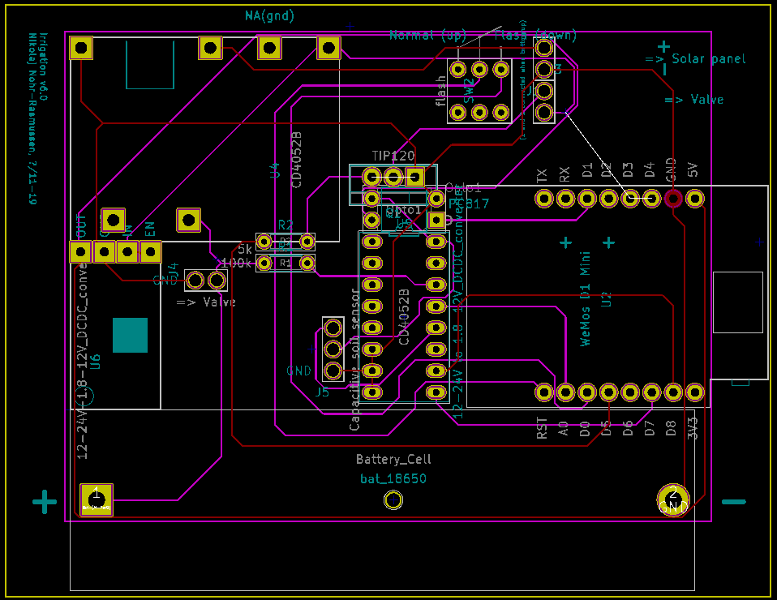

Log History
===========

| Date        | Updates                | Affected modules |
|-------------|------------------------|------------------|
| 15-dec-2019 | Initial public version | all              |
|             |                        |                  |

Save this file as ../README.MD to publish on GitHub with embedded pictures.

Install the plugin <http://www.writage.com/> and export directly from Word.
